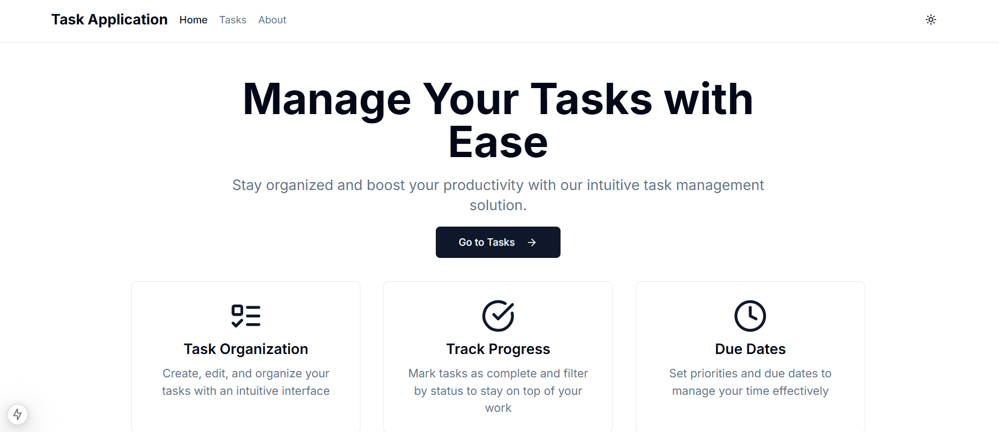

# Task Management App

A modern, responsive task management application built with Next.js that helps you organize and track your daily tasks efficiently.

## Screenshots

<div align="center">
  
  <p><em>Landing Page - Light Mode</em></p>
  
  
  <p><em>Tasks Page - Light Mode</em></p>
  
  
  <p><em>About Page - Light Mode</em></p>

  
  <p><em>Landing Page - Dark Mode</em></p>

  
  <p><em>Tasks Page - Dark Mode</em></p>

  
  <p><em>About Page - Dark Mode</em></p>
</div>

## Features

### Task Management
- Create, edit, and delete tasks with ease
- Set priority levels (Low, Medium, High) for better task organization
- Add due dates to keep track of deadlines
- Mark tasks as completed to track progress

### Organization & Filtering
- Filter tasks based on status, priority, or due date
- Search functionality to quickly find specific tasks
- Sort tasks by priority level or upcoming deadlines
- Clear and intuitive task categorization

### User Experience
- Dark mode support for comfortable viewing in any lighting condition
- Fully responsive design that works seamlessly across all devices
- Persistent storage using browser's local storage
- Clean and modern user interface built with Tailwind CSS and Shadcn components

## Technology Stack

- **Frontend Framework**: Next.js
- **Styling**: Tailwind CSS
- **UI Components**: Shadcn
- **State Management**: Local Storage API
- **Language**: JavaScript

## Getting Started

### Prerequisites

- Node.js (v14 or higher)
- npm or yarn package manager

### Installation

1. Clone the repository:
```bash
git clone https://github.com/CJDayag/Task_Application.git
```

2. Navigate to the project directory:
```bash
cd Task_Application
```

3. Install dependencies:
```bash
npm install
# or
yarn install
```

4. Start the development server:
```bash
npm run dev
# or
yarn dev
```

5. Open your browser and visit `http://localhost:3000`

## Usage

1. **Creating a Task**
   - Click the "Add Task" button
   - Fill in the task details including title, description, priority, and due date
   - Click "Save" to create the task

2. **Managing Tasks**
   - Click on a task to view or edit its details
   - Use the checkbox to mark tasks as completed
   - Click the delete icon to remove tasks
   - Use the filter and sort options to organize your task list

3. **Dark Mode**
   - Toggle the theme switch in the navigation bar to change between light and dark modes
